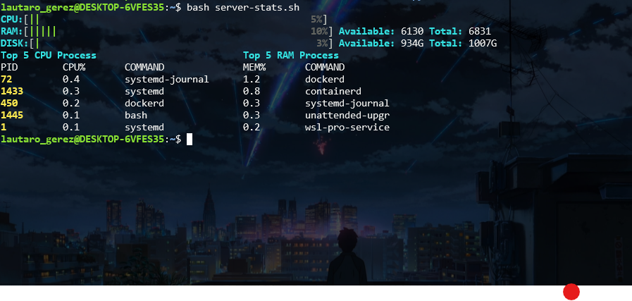

# server-stats.sh

Script de shell para analizar estadísticas básicas de rendimiento de un servidor Linux, sin depender de herramientas externas (solo comandos estándar disponibles en cualquier distro).
[Proyecto de Roadmap.sh](https://roadmap.sh/projects/server-stats)
## Qué muestra

- Uso total de CPU (%)
- Uso total de memoria (Available vs Total, con %)
- Uso total de disco (Available vs Total, con %)
- Top 5 procesos por uso de CPU
- Top 5 procesos por uso de memoria

## Uso

```bash
chmod +x server-stats.sh
./server-stats.sh
```

o directamente:

```bash
bash server-stats.sh
```

## Ejemplo de salida



## Cómo funciona

El script está organizado en funciones independientes, cada una con una única responsabilidad:

- `cpu_usage()`: calcula el % de uso de CPU
- `mem_usage()`: calcula uso de memoria
- `disk_usage()`: calcula uso de disco
- `top_5_process()`: lista los 5 procesos con mayor consumo de CPU y de memoria
- `progress_bar()`: renderiza una barra de progreso coloreada, reutilizada por CPU, memoria y disco

### CPU

Se usa `top -bn2 -d1` (dos muestras separadas por 1 segundo) en lugar de una sola muestra (`-bn1`). Esto es necesario porque una única lectura de `top` puede reflejar el acumulado desde el arranque del sistema en vez del uso reciente real. Se descarta la primera muestra (`sed 1d`) y se calcula:

```
% CPU usado = 100 - % idle
```

### Memoria

Se usa `free -m`. El script muestra **Available** en lugar de **Free**, de forma intencional: `free` (memoria totalmente sin tocar) suele ser un número engañosamente bajo en Linux, porque el kernel usa RAM libre agresivamente como cache de disco. `available` es una estimación más realista de cuánta memoria puede usar un nuevo proceso sin necesidad de swap, y por eso es más útil para un reporte de rendimiento.

### Disco

Se usa `df -h /`, apuntando explícitamente al punto de montaje raíz (`/`) en vez de filtrar toda la tabla de `df -h` con `grep`/`awk`. Esto es más simple y portable entre distintos servidores, sin depender del nombre del dispositivo (`/dev/sda`, `/dev/sdc`, etc.).

### Top de procesos

Se usa `ps` en sintaxis POSIX (`-e -o columnas --sort=-columna`) en lugar de `ps aux` (sintaxis BSD), ya que ambos estilos no pueden mezclarse en el mismo comando. `ps` da una tabla de procesos más simple de parsear que `top`, y permite ordenar directamente con `--sort=`.

## Requisitos

Comandos estándar de cualquier distro Linux: `top`, `free`, `df`, `ps`, `awk`, `sed`, `paste`. No requiere instalar nada adicional.

## Decisiones de diseño

- **Available vs Free**: se prioriza `available` por ser más representativo del estado real de la memoria del servidor.
- **`ps` vs `top` para procesos**: se eligió `ps` por su salida más simple de parsear y su ordenamiento nativo con `--sort=`.
- **Doble muestra de CPU**: se sacrifica ~1 segundo de ejecución extra a cambio de una medición de CPU confiable, en vez de una lectura potencialmente errónea con una sola muestra.
